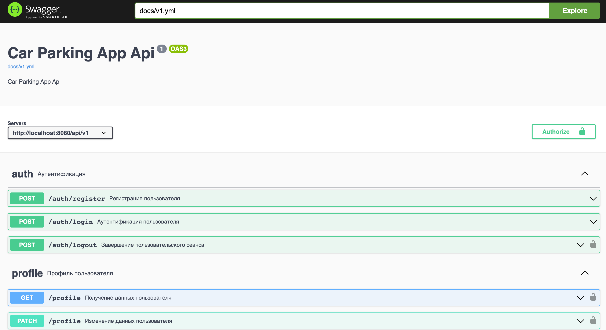

# Car Parking App (API)

Приложение для парковки транспортного средства в выбранной зоне парковки (API).

Используется вместе с [приложением на Vue3.js](https://github.com/poymanov/laravel-daily-car-parking-app-frontend-vue).

### Функционал

- Пользователи могут регистрироваться и аутентифицироваться;
- Добавление транспортных средств в учетную запись;
- Добавление парковочных зон для расчета стоимости парковки;
- Запуск сеанса парковки;
- Остановка сеанса парковки;
- Получение активных сеансов парковки аутентифицированного пользователя;
- Получение завершенных сеансов парковки аутентифицированного пользователя.

### Предварительные требования

Для запуска приложения требуется **Docker** и **Docker Compose**.

### Основные команды

| Команда                      | Описание                                                            |
|:-----------------------------|:--------------------------------------------------------------------|
| `make init`                  | Инициализация приложения                                            |
| `make up`                    | Запуск приложения                                                   |
| `make down`                  | Остановка приложения                                                |
| `make backend-test`          | Запуск тестов                                                       |
| `make backend-run-queue`     | Запуск менеджера очередей                                           |
| `make backend-run-schedule`  | Запуск отслеживания запланированных команд                          |
| `make backend-pint-fix`      | Исправление ошибок форматирования кода (Laravel Pint)               |
| `make backend-lint`          | Запуск проверки качества кода (Laravel Pint + Larastan)             |
| `make docker-create-network` | Создание docker-network (для взаимодействия с frontend-приложением) |

### Интерфейсы

Приложение - http://localhost:8080/api/v1

Документация - http://localhost:8081

---

Код написан в образовательных целях в рамках курса [Build Laravel API for Car Parking App: Step-By-Step](https://laraveldaily.com/course/build-laravel-api-step-by-step).
